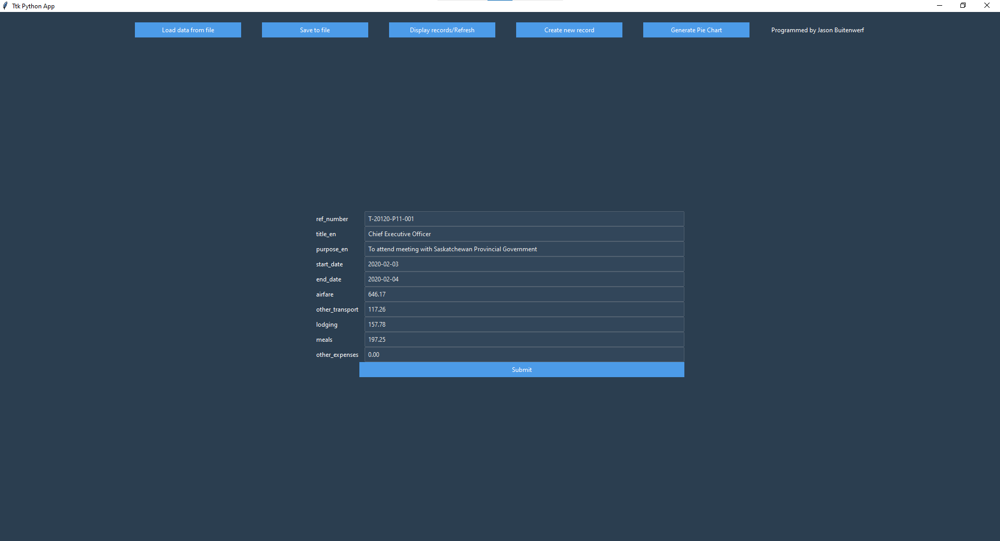
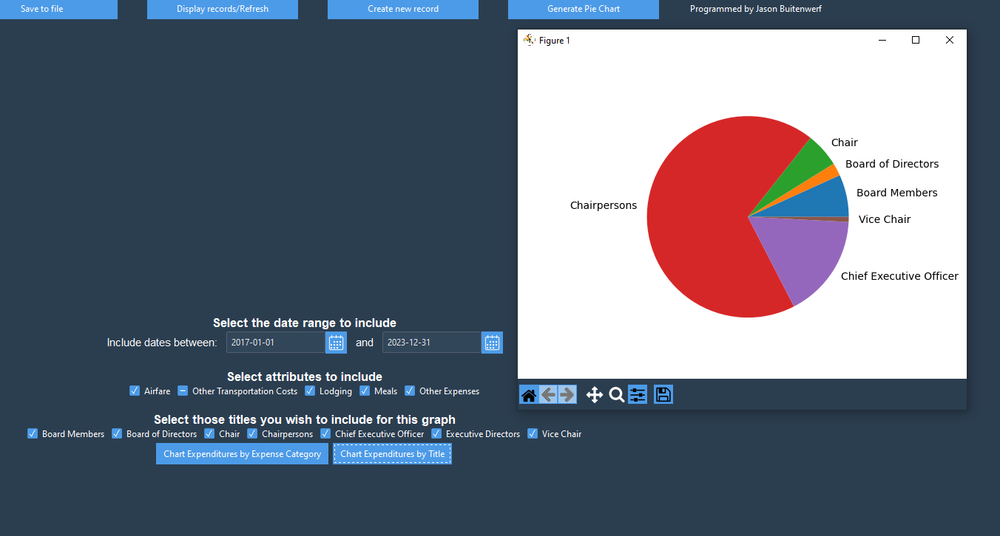

# Python-Desktop-App
Contains information licensed under the Open Government Licence – Canada
see https://open.canada.ca/en/open-government-licence-canada

The data contained in travelq.csv, which is used in this program, was obtained from:
https://open.canada.ca/data/en/dataset/009f9a49-c2d9-4d29-a6d4-1a228da335ce/resource/8282db2a-878f-475c-af10-ad56aa8fa72c

This Project represents a simple application that interacts with a database and can display the data in a piechart as well as in the basic tabular format, I have written it as a means to learn Python as I was not yet familiar with the language when I started this project.

Below are the new screenshots after having switched to ttkbootstrap and using the "superhero" theme provided. Note, I had not tested the previous version of the app with the full dataset, and upon doing so I discovered and removed a number of outliers in the dataset. I also discovered that I was not able to display all of the data at once, and was forced to limit the number of records that would be shown, this is a temporary solution and I plan to implement a paginated version soon.

Records can be seen here, the list is scrollable and individual records can be deleted or updated.

This is what the user is presented with upon clicking "create new" or the update button on a record. The fields are blank in the case of a new record and are prefilled with the appropriate data when updating a record.

This is a pie chart generated using Matplotlib, it shows the travel expenses grouped by category, the user can generate one like this or group by the title associated with each record as shown below:

This pie chart shows the travel expenses grouped by title.

The user may choose wether to include or exclude data based on various criteria, here only the expenses associated with transportation are shown, and it is grouped by title.

Programmed by Jason Buitenwerf
